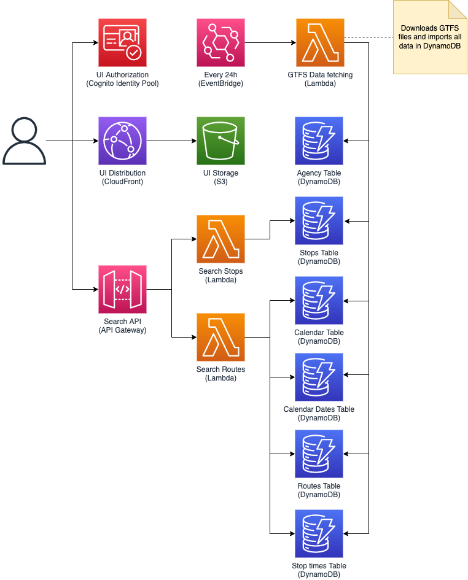
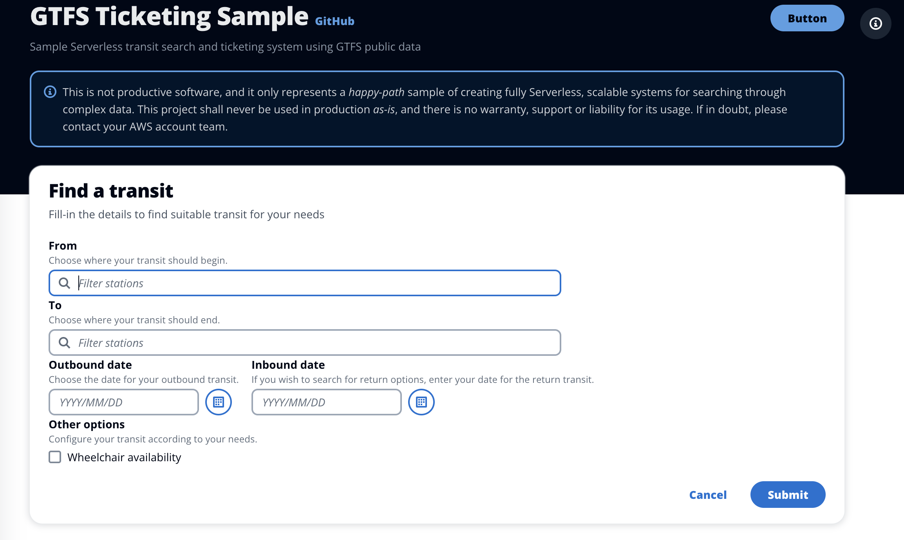
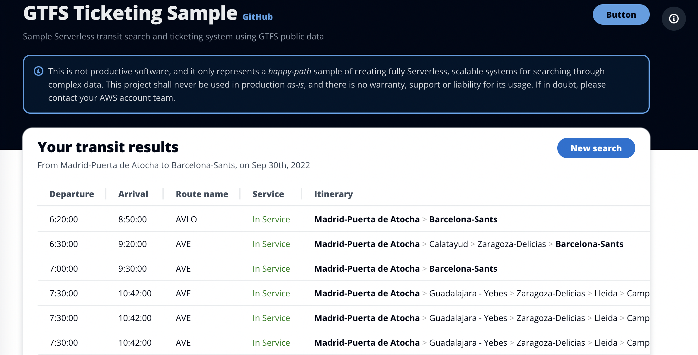

# GTFS Ticketing sample

Welcome! This repository contains the sample project called GTFS ticketing, a sample transit ticketing service that uses public GTFS data for offering transit routes to customers. This project contains the following components:

* GTFS data-fetching function that collects configured GTFS zip files and stores transit information. This function is called periodically to keep data in sync.
* Serverless API that provides endpoints for:
  * Information about transit stops.
  * Information about available routes from A to B on a given date.
* Sample UI to execute the end to end use case.
* Load simulator that executes scalability and latency tests on APIs on-demand.
* Infrastructure as code for all components.

This repository contains both infrastructure definitions and software components. You can deploy it in your AWS account using the [AWS Cloud Development Kit](https://aws.amazon.com/cdk/).

## Getting started

### Install dependencies

This project's scripts rely on a few dependencies that must be installed in your workstation:

* Node.js and NPM.
* JQ.
* AWS CLI.
* AWS CDK.

_NOTE: The scripts included in this project are meant to be executed on Unix machines, and may not work on other environments._

### (Optional) Configure the system's data

You can customize this project so it uses the GTFS data of your choice, hence being able to tailor the transits that the project will offer users. To do that, go to `packages/infra/lib/infra-stack` and follow the steps commented in line 58 and below. By default, the system will load the GTFS data for regional and long-distance spanish railway services.

### Prepare and deploy source code

This project has several packages structured in a _monorepo_. To successfully spin up this project in your AWS account, you need to follow these steps:

* Run `npm install` on the root folder. This will install dependencies for the whole project.
* Run `npm run prepare` on the root folder. This will prepare all project's packages.
* Run `npm run deploy` on the root folder. This will deploy the infrastructure in your AWS account.
* Run `npm run deliver` on the root folder. This will prepare and deliver the UI.
* Run `npm run get-ui-url` on the root folder. This will output the URL of your delivered sample.

Once all these steps are ran you should have a deployed copy of this project in your AWS account. Simply go to the URL retrieved in the last step to start interacting with the system.

## Usage

### Finding routes for your trip

The main functionality this project offers is the capability to find routes from point A to point B on a given date. It does so by filtering the GTFS data imported using the information entered by the user. Users need to enter an Origin, a Destination, and an outbound date. With this data, the users are given a table of possible routes.

## Security

See [CONTRIBUTING](CONTRIBUTING.md#security-issue-notifications) for more information.

## License

This library is licensed under the MIT-0 License. See the LICENSE file.
